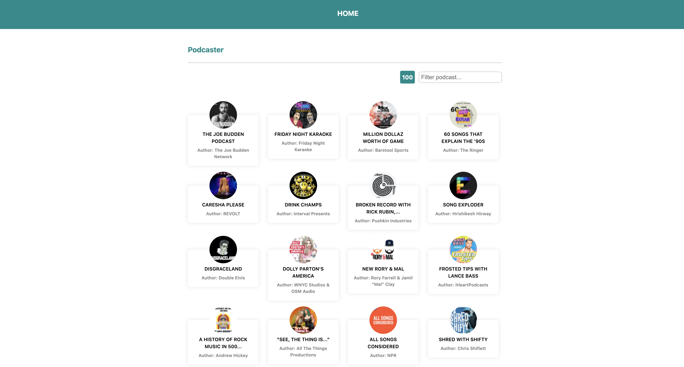
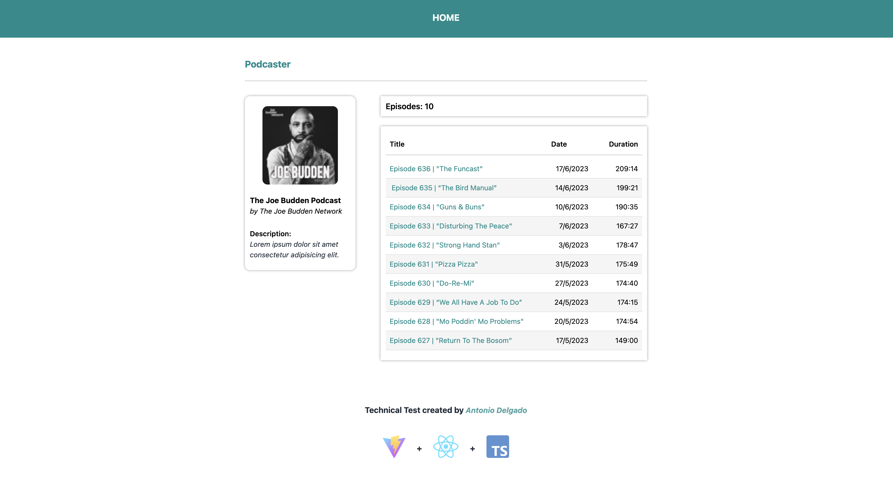
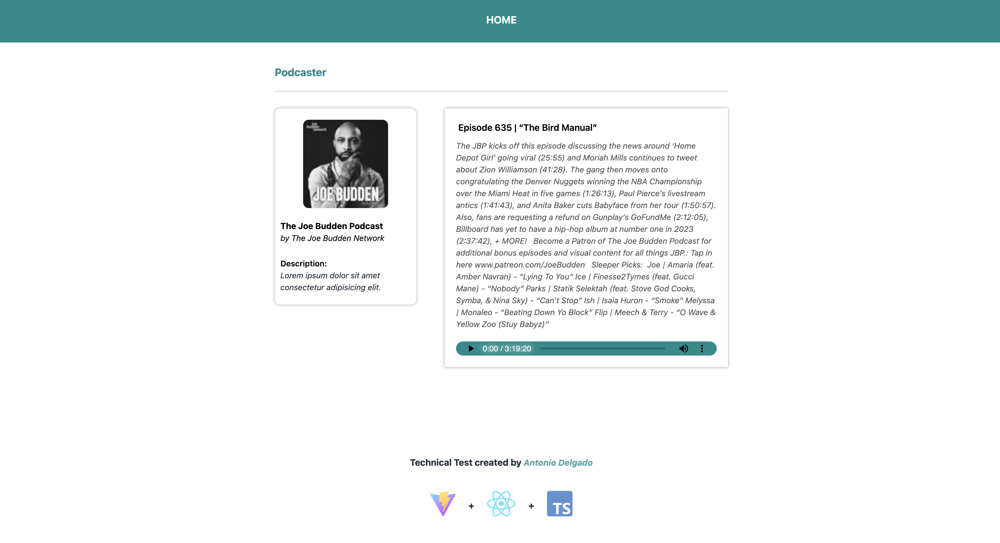

# Podcast-React-Vite-TS_Test

DEFINITION

For the realization of this project I have done it under a structural and creational design, always trying to encapsulate the code with a defined purpose. I have used to assemble the project with Vite, React, Context-API, TypeScript, Vitest/Jest, React Testing Library...

I decided to use vite, for its speed and lightness. It is one of the options recommended by the React official documentation.

FACILITY

Podcast-React-Vite-TS_Test is developed in React with Vite, so for the installation of dependencies it is necessary to have Node and Vite. Once both are installed, go to the root of the project and run "npm install" to install all the necessary dependencies.

PERFORMANCE

To run the project on port 5173 i's necessary to go to the root of the project and execute "npm run dev". And go to http://127.0.0.1:5173/, Youe will see the application

TESTING

To launch the tests, go to the root of the project and execute "npm run test" in the console. All tests it detects will start.

SCREENSHOTS

